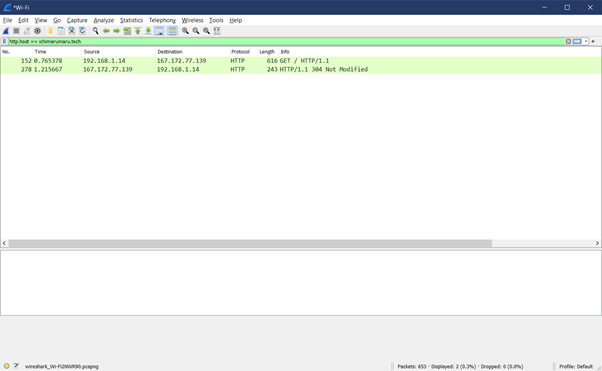
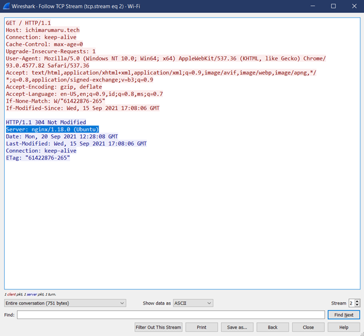
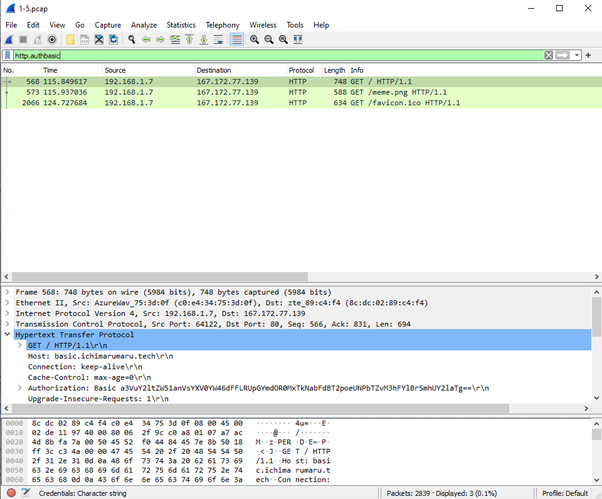
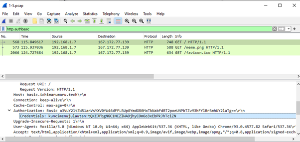
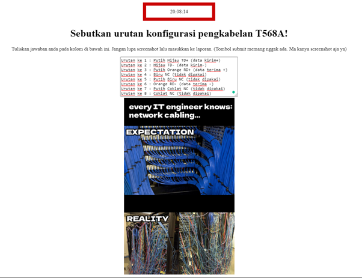
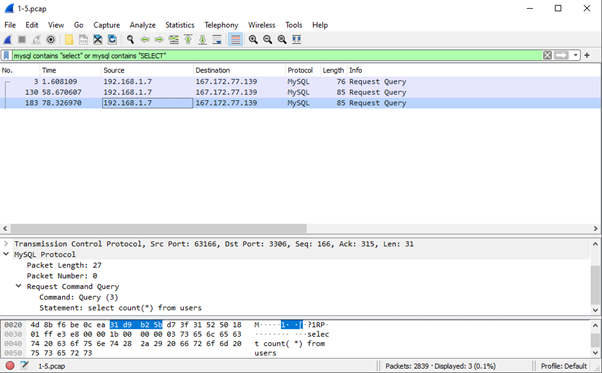
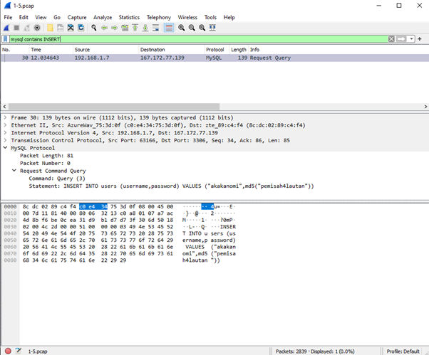
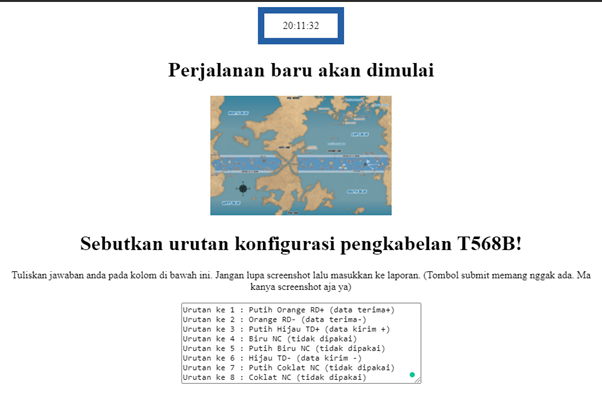

# Jarkom-Modul-1-E09-2021

## Anggota
### 1. Dwinanda Bagoes Ansori (05111940000010)
### 2. Bayu Eka Prawira (05111940000042)
### 3. Kelvin Andersen (05111940000080)

<br><br><br>

## 1. Sebutkan webserver yang digunakan pada "ichimarumaru.tech"!
Dengan menggunakan Wireshark filter expression: ```http.host == ichimarumaru.tech``` didapatkan dua paket sebagai berikut \
 \
Pada paket paling atas, kita follow TCP Stream dan menampilkan informasi sebagai berikut \
 \
Sehingga didapatkan webserver yang digunakan pada "ichimarumaru.tech" adalah **nginx/1.18.0 (Ubuntu)**

## 2. Temukan paket dari web-web yang menggunakan basic authentication method!
Dengan menggunakan Wireshark filter expression: ```http.authbasic``` didapatkan tiga paket sebagai berikut \
 \
Dapat dilihat pada detail, terdapat informasi **Authorization : Basic**

## 3. Ikuti perintah di basic.ichimarumaru.tech! Username dan password bisa didapatkan dari file .pcapng!
Dari hasil temuan paket dari nomor 2, pada informasi *Authorization : Basic* terdapat *Credentials : kuncimenujulautan:tQKEJFbgNGC1NCZlWAOjhyCOm6o3xEbPkJhTciZN* yang merupakan username : ```kuncimenujulautan``` dan password : ```tQKEJFbgNGC1NCZlWAOjhyCOm6o3xEbPkJhTciZN``` \
 \
Lalu menjawab yang ada dalam basic.ichimarumaru.tech yang merupakan soal untuk menyebutkan urutan konfigurasi pengkabelan T568A
```
Urutan ke 1 : Putih Hijau TD+ (data kirim+)
Urutan ke 2 : Hijau TD- (data kirim-)
Urutan ke 3 : Putih Orange RD+ (data terima +)
Urutan ke 4 : Biru NC (tidak dipakai)
Urutan ke 5 : Putih Biru NC (tidak dipakai)
Urutan ke 6 : Orange RD- (data terima -)
Urutan ke 7 : Putih Coklat NC (tidak dipakai)
Urutan ke 8 : Coklat NC (tidak dipakai)
``` 


## 4. Temukan paket mysql yang mengandung perintah query select!
Dengan menggunakan Wireshark filter expression: ```mysql contains "select" or mysql contains "SELECT"``` didapatkan tiga paket sebagai berikut \
 \

## 5. Login ke portal.ichimarumaru.tech kemudian ikuti perintahnya! Username dan password bisa didapat dari query insert pada table users dari file .pcap!
Dengan menggunakan Wireshark filter expression: ```mysql contains INSERT``` didapatkan satu paket sebagai berikut \
 \
Dan didapatkan informasi username : "akakanomi" dan password : "pemisah4lautan". \
Lalu mengerjakan soal pada portal.ichimarumaru.tech untuk menyebutkan urutan konfigurasi pengkabelan T568B
```
Urutan ke 1 : Putih Orange RD+ (data terima+)
Urutan ke 2 : Orange RD- (data terima-)
Urutan ke 3 : Putih Hijau TD+ (data kirim +)
Urutan ke 4 : Biru NC (tidak dipakai)
Urutan ke 5 : Putih Biru NC (tidak dipakai)
Urutan ke 6 : Hijau TD- (data kirim -)
Urutan ke 7 : Putih Coklat NC (tidak dipakai)
Urutan ke 8 : Coklat NC (tidak dipakai)
```


## 6. Cari username dan password ketika melakukan login ke FTP Server!
## 7. Ada 500 file zip yang disimpan ke FTP Server dengan nama 0.zip, 1.zip, 2.zip, ..., 499.zip. Simpan dan Buka file pdf tersebut. (Hint = nama pdf-nya "Real.pdf")
## 8. Cari paket yang menunjukan pengambilan file dari FTP tersebut!
## 9. Dari paket-paket yang menuju FTP terdapat indikasi penyimpanan beberapa file. Salah satunya adalah sebuah file berisi data rahasia dengan nama "secret.zip". Simpan dan buka file tersebut!
## 10. Selain itu terdapat "history.txt" yang kemungkinan berisi history bash server tersebut! Gunakan isi dari "history.txt" untuk menemukan password untuk membuka file rahasia yang ada di "secret.zip"!
## 11. Filter sehingga wireshark hanya mengambil paket yang berasal dari port 80!
## 12. Filter sehingga wireshark hanya mengambil paket yang mengandung port 21!
## 13. Filter sehingga wireshark hanya menampilkan paket yang menuju port 443!
## 14. Filter sehingga wireshark hanya mengambil paket yang tujuannya ke kemenag.go.id!
## 15. Filter sehingga wireshark hanya mengambil paket yang berasal dari ip kalian!